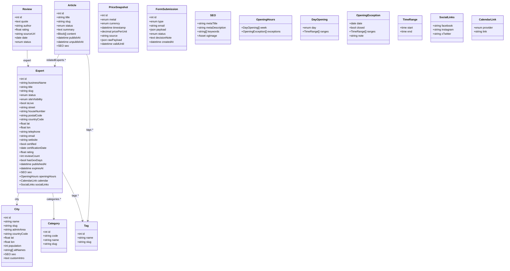

# DataObjects — Glossary & Implementation Guide

This document describes the Pimcore DataObjects and related design decisions used by the Goldexperte project. It contains field definitions, relations, index recommendations, migration helpers and rationale.

---

## 1) Expert (DataObject: `Expert`)

Purpose: a jeweler/expert profile shown on city pages and on detail pages.

Key relations

- `city` → `City` (many-to-one)
- `categories[]` → `Category` (many-to-many)
- `tags[]` → `Tag` (many-to-many)
- `reviews[]` → `Review` (inverse: review has `expertRef`)

Fields

- Identity
  - `title` (string) — optional marketing label, e.g. “Goldexperte”
  - `businessName` (string, required)
  - `slug` (string, unique per site)
  - `status` (enum: `draft` / `review` / `live` / `archived`)
  - `siteVisibility` (enum: `gold` | `verlobungsring` | `both`)
  - `isLive` (bool) — quick API filter (mirrors `status == live`)

- Address & Geo
  - `street` (string)
  - `houseNumber` (string)
  - `postalCode` (string)
  - `city` (relation → `City`)
  - `countryCode` (string, default `DE`/`AT`, ISO 3166-1 alpha-2)
  - `geo` (Geopoint: `lat`, `lon`)

- Contact
  - `telephone` (string)
  - `email` (email)
  - `website` (link)
  - `socialLinks` (brick: `SocialLinks`)

- Metadata / Business
  - `specialties[]` (multi-select or tags) — e.g., `Goldankauf`, `Uhrenservice`
  - `badges[]` (multi-select) — e.g., `zertifiziert`, `premium`
  - `certified` (bool)
  - `certificationDate` (date, nullable)
  - `rating` (decimal(2,1))
  - `reviewCount` (int)

- Content
  - `description` (WYSIWYG or textarea/markdown)
  - `openingHours` (brick: `OpeningHours` — structured)
  - `alternatingBlocks[]` (field collection: `AlternatingContentBlock`)
  - `gallery[]` (assets)
  - `logo` (asset)
  - `heroImage` (asset)

- Booking / Events
  - `calendar` (brick: `CalendarLink`: provider enum, link string)
  - `hasGexDays` (bool) — optional feature flag for special days

- SEO
  - `seo` (brick: `SEO`: `metaTitle`, `metaDescription`, `keywords[]`, `ogImage`)

- Links (optional overrides)
  - `googleMapsUrl` (string) — override if needed
  - `mapEmbedUrl` (string) — optional override

- System
  - `publishedAt` (datetime)
  - `expiresAt` (datetime, nullable)
  - `createdAt`, `updatedAt` (auto)

Notes

- Keep images in Pimcore Assets to enable transformations (WebP/AVIF) and alt text.
- Structured `openingHours` enables reliable "open now" filtering.
- `alternatingBlocks` map 1:1 from existing arrays (title, text, image).

---

## 2) City (DataObject: `City`)

Purpose: canonical city record for landing pages, geo anchor and suggest.

Fields

- `name` (string) — e.g., Wien
- `slug` (string, unique) — e.g., `wien`
- `adminArea` (string) — e.g., Wien / Bayern
- `countryCode` (string, default `AT`)
- `geo` (Geopoint)
- `population` (int, optional)
- `altNames[]` (string list) — e.g., `Vienna`

City page content (hybrid SEO)

- `customIntro` (WYSIWYG) — overrides or extends autogenerated intro
- `faq[]` (field collection: Q/A)
- `featuredExperts[]` (relations → `Expert`)
- `seo` (brick: `SEO`)

---

## 3) Article (DataObject: `Article`)

- `title`, `slug`, `status`
- `summary` (text)
- `content` (modular blocks / area blocks: text, image, gallery, quote, chart embed)
- `heroImage` (asset)
- `tags[]` (→ `Tag`)
- `relatedExperts[]` (→ `Expert`)
- `publishAt`, `unpublishAt`
- `seo` (brick: `SEO`)

---

## 4) Review (DataObject: `Review`)

- `expert` (→ `Expert`)
- `quote` (text)
- `author` (string)
- `rating` (decimal(2,1), optional)
- `sourceUrl` (link, optional)
- `date` (date)
- `status` (enum: `draft` / `live`)

Notes

- Attach curated quotes manually and render Schema.org Review when appropriate.

---

## 5) PriceSnapshot (DataObject: `PriceSnapshot`)

- `metal` (enum: XAU | XAG | XPT)
- `currency` (enum: EUR)
- `timestamp` (datetime)
- `pricePerUnit` (decimal(12,4)) — define unit convention (gram/ounce)
- `source` (string, e.g. `metals-api`)
- `rawPayload` (JSON textarea)
- `validUntil` (datetime, optional)

Notes

- Keep snapshots only when delta > threshold. Pre-aggregate for 5Y/Max charts.

---

## 6) FormSubmission (DataObject: `FormSubmission`)

- `type` (enum: `become_expert`, `contact`)
- `email` (email)
- `payload` (JSON textarea) — company, message, etc.
- `status` (enum: `received` / `reviewed` / `accepted` / `rejected`)
- `decisionNote` (text)
- `createdAt` (datetime)

Notes

- Backend sends Postmark templates on create & status changes.

---

## 7) Taxonomy

- Category (DataObject: `Category`)
  - `code` (string, unique) — e.g., `goldankauf`
  - `name` (string)
  - `slug` (string)
  - `parent` (self-relation, optional)
  - `seo` (brick: `SEO`, optional)

- Tag (DataObject: `Tag`)
  - `name`, `slug`

---

## 8) MediaAsset (optional)

If you want standardized alt/copyright metadata across assets:

- Use Pimcore Asset metadata (recommended), or
- Create a small DataObject wrapping Asset + fields `alt`, `copyright`.

---

## 9) Reusable Bricks / Field Collections

- Brick: `OpeningHours` (structured)
  - `week[]` (field collection `DayOpening`)
  - `day` (enum: `mon..sun`)
  - `ranges[]` (table: `start time`, `end time`) — multiple intervals per day
  - `exceptions[]` (field collection `OpeningException`)
    - `date` (date)
    - `note` (string)
    - `ranges[]` (like above) or `closed` (bool)

  This structure lets you compute `open_now` reliably (locale / timezone aware).

- Brick: `SocialLinks`
  - `facebook`, `instagram`, `xTwitter` (strings) — extendable

- Brick: `SEO`
  - `metaTitle`, `metaDescription`, `keywords[]`, `ogImage` (asset)

- Brick: `CalendarLink`
  - `provider` (enum: `cal.com`, `calendly`)
  - `link` (string)

- Field Collection: `AlternatingContentBlock`
  - `title` (string)
  - `text` (WYSIWYG or markdown)
  - `image` (asset)
  - `imageAlt` (string)

---

## 10) Search Mirror (SQL table, not a DataObject)

Why: keep Pimcore objects clean; use a fast geo-enabled table with spatial index instead of Elastic.

Table: `search_expert_geo`

Columns (recommended):

- `expert_id` INT (PK, FK → `Expert`) — PK
- `is_live` TINYINT(1) — IDX
- `site` ENUM('gold','verlobungsring','both') — IDX
- `city_id` INT — IDX
- `name` VARCHAR — FULLTEXT (optional)
- `categories_json` JSON
- `lat` DECIMAL(9,6)
- `lon` DECIMAL(9,6)
- `location` POINT SRID 4326 — SPATIAL INDEX
- `open_now` TINYINT(1) (optional cache) — IDX
- `updated_at` DATETIME

Maintained by: Symfony Subscriber on Expert publish/update/unpublish/delete

Compute `location = ST_SRID(POINT(lon, lat), 4326)` when writing the mirror row.

Mirror fields: `is_live`, `site`, `city_id`, `categories_json` (codes), `open_now` (optional).

Remove mirror row on unpublish/delete.

Nearby query example:

```sql
SET @p = ST_SRID(POINT(:lon, :lat), 4326);

SELECT expert_id,
       ST_Distance_Sphere(location, @p) AS distance_m
FROM search_expert_geo
WHERE is_live = 1
  AND site IN ('gold','both')
  AND ST_Distance_Sphere(location, @p) <= :radius_m
ORDER BY distance_m ASC
LIMIT 50;
```

Frontend flow: call your REST `/experts/near?lat=…&lon=…&radius=…` and hydrate details by batch-loading `Expert` objects for returned IDs.

---

## 11) API Contracts (short)

- `GET /api/v1/experts?city=wien&category=goldankauf&limit=20&cursor=…`
- `GET /api/v1/experts/{slug}`
- `GET /api/v1/experts/near?lat=48.2082&lon=16.3738&radius=25km&category=goldankauf`
- `GET /api/v1/cities/suggest?q=wie&limit=8`
- `GET /api/v1/articles?tag=…`
- `GET /api/v1/prices/latest?metal=XAU&currency=EUR`
- `GET /api/v1/prices/series?metal=XAU&currency=EUR&range=30D`
- `POST /api/v1/forms/become-expert`

---

## 12) Mapping from current TS → new model

Mapping rules (high level):

- `Goldexperte` → `Expert`
  - `businessName`, `slug`, `description`, `specialties[]` → keep
  - `address` → split: `street`, `houseNumber`, `postalCode`, `city` (relation)
  - `city` (string) → map to `City` (create if missing) and set relation
  - `open` → computed from `openingHours` (no need to store)
  - `openingHours` (strings) → convert to `OpeningHours.week[ranges]`
  - `imageUrl`, `aboutImageUrl`, `carousel[]` → assets (`logo`, `heroImage`, `gallery[]`)
  - `rating`, `reviewCount`, `certified`, `certificationDate`, `hasGexDays` → map to same fields
  - `calendarType`, `calendarLink` → `CalendarLink` brick
  - `socialLinks` → `SocialLinks` brick
  - `mapEmbedUrl`, `googleMapsUrl` → optional overrides
  - `seoData` → `SEO` brick
  - City text blocks → `City.customIntro` / `FAQ` / `SEO`
  - Alternating content arrays → `AlternatingContentBlock[]` on `Expert`

---

## 13) UML (Mermaid)



---

## 14) Constraints & Indexing

- Expert
  - Unique: (`slug`, `siteVisibility`)
  - Index: `isLive`, `city`, `status`, `siteVisibility`
  - For geo: store `lat`/`lon` and mirror a `POINT` in `search_expert_geo.location` with a SPATIAL INDEX

- City
  - Unique: `slug`
  - Index: `adminArea`, `countryCode`

- PriceSnapshot
  - Composite index: (`metal`, `currency`, `timestamp DESC`)

- FormSubmission
  - Index: `type`, `status`, `createdAt`

---

## 15) Migration Helpers (high level)

Build a small import script to convert current TS JSON → Pimcore with these steps:

- Ensure `City` exists (create with `lat`/`lon` from known list)
- Create `Expert` with mapped fields
- Parse `openingHours` strings (e.g. "10:00 - 13:00 & 14:00 - 18:00") → `DayOpening.ranges`
- Upload images to Assets; map to `logo` / `heroImage` / `gallery`
- Fill `SEO` brick from `seoData`
- Upsert Search Mirror row

---

## 16) Why this works well

- Local SEO: clean slugs, city pages with content slots, structured data
- Geo search: fast, DB-native radius queries — no Elasticsearch required
- Editor UX: clear fields, reusable bricks/blocks, simple workflows
- Scalability: swap search layer later if needed; API remains stable

---

### Quick TODO checklist

- [ ] Define DataObject classes and bricks in Pimcore
- [ ] Implement `search_expert_geo` mirror and Symfony subscriber
- [ ] Build import/migration script from existing TS JSON
- [ ] Create API endpoints and controllers for search + suggest
- [ ] Add admin map UI for manual pin correction
- [ ] Add monitoring for search mirror updates


---

Generated/edited for readability and consistent Markdown styling.